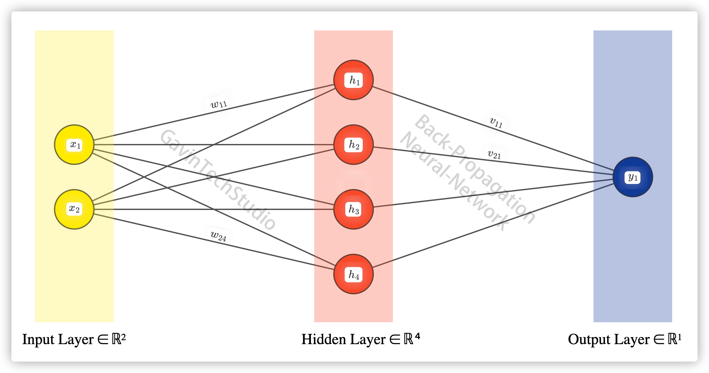

# Back-Propagation-Neural-Network

[](https://github.com/GavinTechStudio/Back-Propagation-Neural-Network)
[](https://github.com/GavinTechStudio/Back-Propagation-Neural-Network)

本项目是基于C++实现基础BP神经网络，有助于深入理解BP神经网络原理。

是对项目[GavinTechStudio/bpnn_with_cpp](https://github.com/GavinTechStudio/bpnn_with_cpp)的代码重构。

## 项目结构

```
.
├── CMakeLists.txt
├── README.md
├── data
│   ├── testdata.txt
│   └── traindata.txt
├── docs
│   └── formula.md
├── img
│   └── net-info.png
├── lib
│   ├── Config.h
│   ├── Net.cpp
│   ├── Net.h
│   ├── Utils.cpp
│   └── Utils.h
└── main.cpp

4 directories, 12 files
```

#### 主要文件

- Net：网络具体实现
- Config：网络参数设置
- Utils：工具类
  - 数据加载
  - 激活函数
- main：网络具体应用

## 训练原理

### 0. 神经网络结构图



###1. Forward(前向传播)

####1.1 输入层向隐藏层传播

$$
h_j = \sigma( \sum_i x_i w_{ij} - \beta_j )
$$

其中$h_j$为第$j$个隐藏层节点的值，$x_i$为第$i$个输入层节点的值，$w_{ij}$为第$i$个输入层节点到第$j$个隐藏层节点的权重，$\beta_j$为第$j$个隐藏层节点偏置值，$\sigma(x)$为**Sigmoid**激活函数，后续也将继续用这个表达，其表达式如下
$$
\sigma(x) = \frac{1}{1+e^{-x}}
$$
代码中的表现如下：

```C++
for (size_t j = 0; j < Config::HIDENODE; ++j) {
  double sum = 0;
  for (size_t i = 0; i < Config::INNODE; ++i) {
    sum += inputLayer[i]->value * inputLayer[i]->weight[j];
  }
  sum -= hideLayer[j]->bias;
  
  hideLayer[j]->value = Utils::sigmoid(sum);
}
```

#### 1.2 隐藏层向输出层传播

$$
\hat{y_k} = \sigma( \sum_j h_j v_{jk} - \lambda_k )
$$

其中$\hat{y_k}$为第$k$个输出层节点的值，$h_j$为第$j$个隐藏层节点的值，$v_{jk}$为第$j$个隐藏层节点到第$k$个输出层节点的权重，$\lambda_k$为第$k$个输出层节点的偏置值，$\sigma(x)$为激活函数。

代码中的表现如下：

```C++
```

